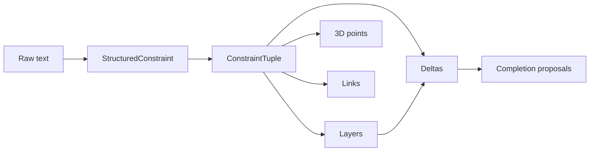
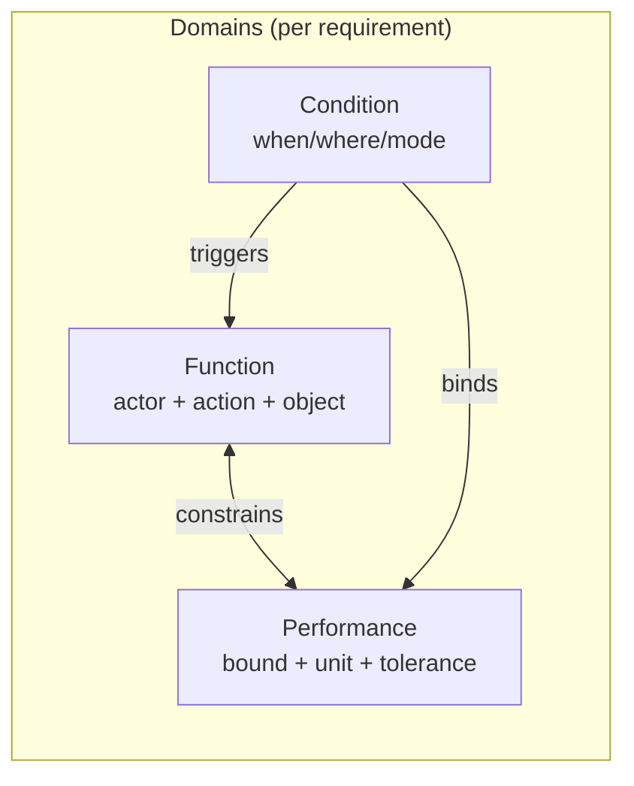
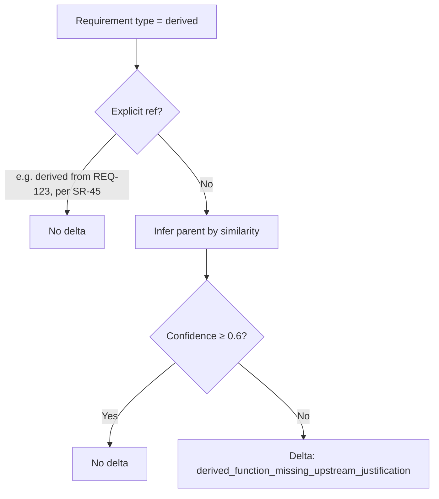

# DCTE (Delta-Constraint Triangulation Engine) – How It Works

## Diagram export (blocks and arrows)

- **PNG**: A flowchart image was generated as `DCTE-flow.png` (if present in this folder, or in the Cursor project assets). The same flow is in `DCTE-flow.mmd`; you can render it with [Mermaid CLI](https://github.com/mermaid-js/mermaid-cli): `npx @mermaid-js/mermaid-cli -i docs/DCTE-flow.mmd -o docs/DCTE-flow.png`.
- **PDF**: Open `docs/DCTE-flow.html` in a browser, then use **File → Print → Save as PDF** to get a PDF of the flowchart.

---

## 1. High-level flow

```mermaid
flowchart TB
  subgraph input["Input"]
    R[RequirementFinding[]]
  end

  subgraph extract["Extraction"]
    E[extractStructuredConstraint]
    E --> SC[StructuredConstraint per req]
    SC --> |"actor, action, object, condition, constraint, mode, timeBound"| SC
    SC --> |"+ optional spans + indices"| SC
  end

  subgraph tuples["Constraint tuples"]
    BT[buildConstraintTuples]
    BT --> CT[ConstraintTuple[]]
    CT --> |"function, performanceBound, condition"| CT
    CT --> |"functionCompleteness, performanceCompleteness, conditionCompleteness (0..1)"| CT
    CT --> |"functionConfidence, performanceConfidence, conditionConfidence"| CT
    CT --> |"evidenceSpans"| CT
  end

  subgraph layers["Three layers"]
    BL[buildLayers]
    BL --> FL[functionalLayer]
    BL --> PL[performanceLayer]
    BL --> CL[conditionLayer]
  end

  subgraph outputs["Outputs"]
    DA[runDeltaAnalysis]
    DA --> DV[ConstraintDeltaVector[]]
    BCP[buildConstraintSpacePoints]
    BCP --> CSP[ConstraintSpacePoint[]]
    BCL[buildConstraintLinks]
    BCL --> LINKS[ConstraintLink[]]
    BPROP[buildCompletionProposals]
    BPROP --> PROP[CompletionProposal[]]
  end

  R --> E
  SC --> BT
  CT --> BL
  CT --> DA
  CT --> BCP
  CT --> BCL
  DV --> BPROP
  CT --> BPROP
```

## 2. Data flow (pipeline)



## 3. Triangulation: three domains and links



- **Function**: what the system shall do (shall + action + object).
- **Performance**: measurable bound (numeric + unit + range/tolerance).
- **Condition**: when/where it applies (condition clause, mode).

Links are created **within** each requirement when both domains are present.  
Deltas are created when one domain is strong and another is weak (e.g. F high, P low → F→P delta).

## 4. Deterministic completeness (→ 3D x, y, z)

| Domain      | Rule (additive, cap 1) |
|------------|-------------------------|
| **Function**   | +0.4 has “shall”, +0.3 action verb, +0.3 object |
| **Performance**| +0.5 numeric bound, +0.3 unit, +0.2 tolerance/range |
| **Condition**  | +0.5 condition exists, +0.3 measurable var, +0.2 range/bounds |

- **x** = functionCompleteness  
- **y** = performanceCompleteness  
- **z** = conditionCompleteness  

Perfect requirement → (1, 1, 1). Sparse regions in 3D = imbalance / risk.

## 5. Delta vector (directional, scored)

```mermaid
flowchart LR
  subgraph delta["ConstraintDeltaVector"]
    FROM[from domain]
    TO[to domain]
    MAG[magnitude = max(0, from_completeness - to_completeness)]
    RISK[riskScore = 100 × magnitude × expectationWeight × confidenceWeight]
    SEV[severity: low / med / high]
  end
  FROM --> TO
  MAG --> RISK
  RISK --> SEV
```

- **from / to**: e.g. function→performance, performance→condition, condition→function.
- **magnitude**: gap between completeness of “from” and “to”.
- **riskScore**: scaled by expectation (e.g. functional req expects F→P) and average confidence.
- **expectationRuleId**: e.g. `F→P_expected`, `derived_justification_expected`.

## 6. Derived justification



- **Explicit**: regex for “derived from REQ-…”, “per SR-…”, “see 3.2.1.4”, etc.
- **Inferred**: token overlap (Jaccard) + shared object/action/metric terms → candidate parent + confidence.

## 7. Where each output is used

| Output                | Used for |
|-----------------------|----------|
| **constraintTuples**  | Completeness/confidence; input to layers, points, links, deltas. |
| **functionalLayer**   | Nodes with function; drive F→P / F→C deltas. |
| **performanceLayer**  | Nodes with bound; drive P→F / P→C deltas. |
| **conditionLayer**    | Nodes with condition; drive C→F / C→P deltas. |
| **constraintSpacePoints** | 3D plot (x, y, z); filters by subsystem / requirement type. |
| **constraintLinks**   | UI: “F —constrains→ P”, “C —triggers→ F”, etc. |
| **deltas**            | UI: directional delta list; input to completion proposals. |
| **completionProposals** | UI: suggested text + placeholders per delta type. |

---

*Generated for ReqVector DCTE.*
